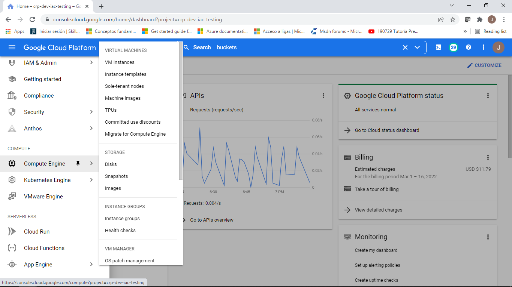
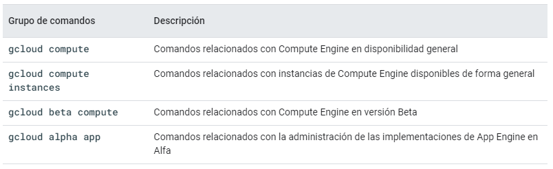
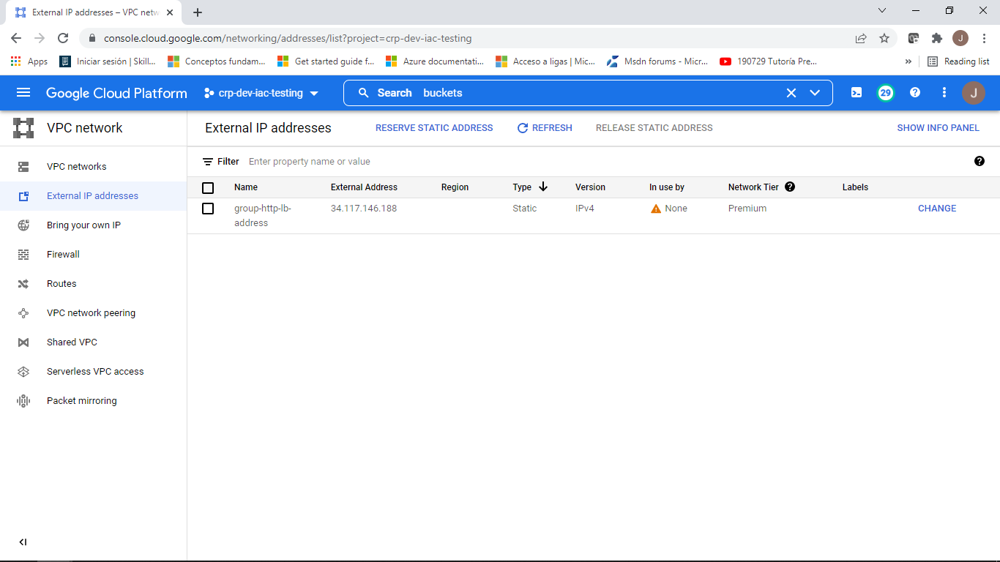
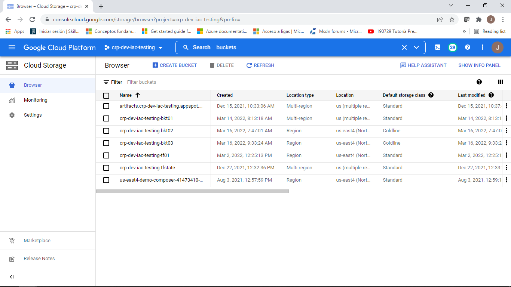
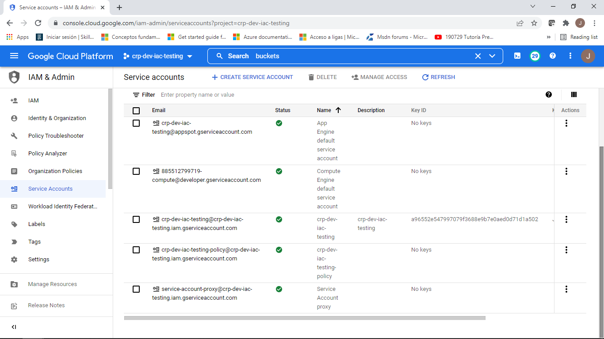

# Tarea 3 "Comandos GCP"

# Equipo Hidra 

### A continuación presentamos las pantallas y los comandos para cada apartado tal y como se muestra.

## **a. Listar Compute Engine**

*Imagen de la consola de GCP para entrar a Compute Engine.*

*Comandos para compute engine*

## **b. Listar IPs en uso, existentes o reservadas.**

*Imagen tomada desde la consola de GCP para ver el listado de IPs*

*Comandos para listar las IPs ocupadas así como la lita de las redes existentes.*

>> gcloud compute addresses list

>> gcloud compute networks list

## **c. Listar buckets disponibles.**

*Imagen tomada desde la consola de GCP para ver los buckets*

*Comandos para listar los buckets*

>> gcloud compute buckets list

## **d. Listar Service Accounts existentes en un proyecto.**

*Para este mostramos la imagen del Sevice Accounts de la consola de GCP*

## Para la obtención de los comando se consultó la siguiente página web.

    

